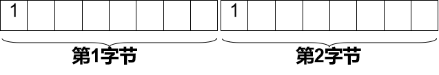
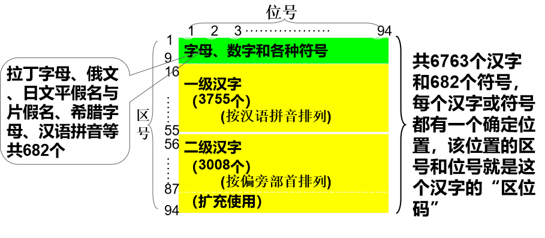
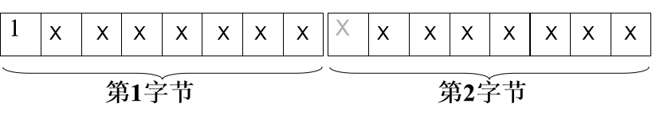
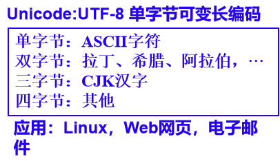
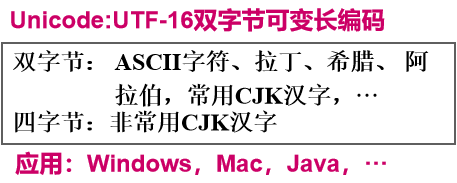
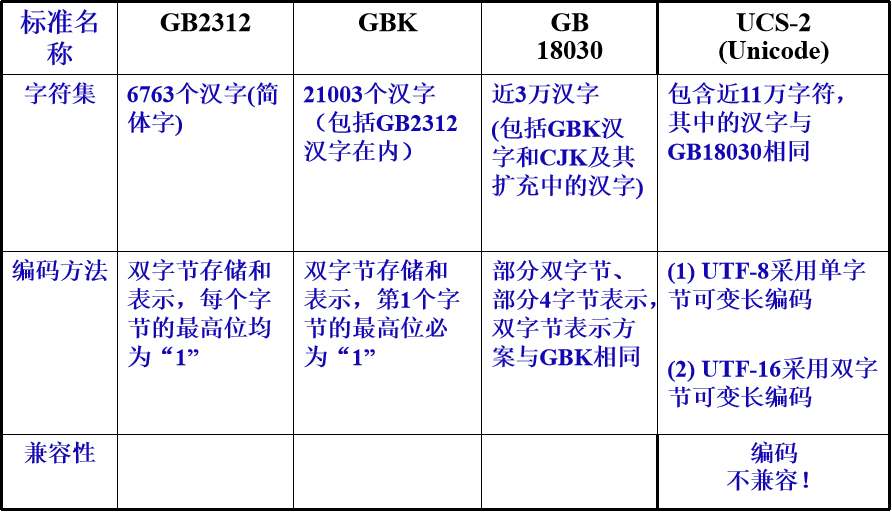

# 03-03汉字在计算机内的表示方法
GB2312-80 国家标准字符集 收录汉字6763个，符号715个，总计7478个字符
GBK 国家标准扩展字符集 兼容GB2312-80。收录21003个汉字，882个符号，共计21885个字符 
GB18030-2000字符集，包含GBK字符集，全部27533个汉字 
ISO/IEC 10646 / Unicode字符集，这是全球可以共享的编码字符集，两者相互兼容，涵盖了世界上主要语言的字符 
## 汉字在计算机内的表示
* 每一个GB2312汉字使用16位（2个字节）表示
* 每个字节的最高位均为“1”
    
## GB2312 汉字编码
* 1981年颁布《信息交换用汉字编码字符集·基本集》
* GB2312字符集由三个部分构成：

* 不足
    * GB2312汉字字数太少，无法满足一些特殊应用的需要：
        人名、地名、古籍整理、古典文献研究
    * 没有繁体字
    * 编码效率不高： (6763+682) / 65536
    * 与ASCII码不兼容
## GBK汉字内码扩充规范
* 1995年颁布
* 在GB2312基础上，增加了1万多汉字（包括繁体字）和符号
* 共有21003个汉字和883个图形符号，如“計算機”、冃、冄、円、冇等繁体字和生僻字 
* 与GB8312保持向下兼容，也使用双字节表示，第1字节最高位必须为“1”：
* 

 ## UCS/Unicode
* 背景：为了实现全球数以千计的不同语言文字的统一编码
* 方案：ISO将全球所有文字字母和符号集中在一个字符集中进行统一编码(目前共收集了17x216＝1,114,112 个) ，称为UCS/Unicode
* UCS/Unicode的编码方案：
    - 先实现部分字符的编码（近11万个字符）
    - 尽量与已有编码标准兼容
    - 包含有中、日、韩统一整理出来的约7万汉字（称CJK汉字）
    - 允许有若干不同的编码方案, 常用的两种是：
        
        

## GB18030汉字编码标准
* 背景：无论是Unicode的UTF-8还是UTF-16，其CJK汉字字符集虽然覆盖了我国已使用多年的GB2312和GBK标准中的汉字，但它们的编码并不相同
* 为了既能与UCS/Unicode编码标准接轨，又能保护我国已有的大量汉字信息资源，我国在2000年和2005年两次发布GB18030汉字编码国家标准
*  GB18030是Unicode字符集（10万字符）的另一种编码方案：
    - 单字节编码（128个）表示ASCII字符,  删除欧元符号
    - 双字节编码（23940个）表示汉字，与GBK（以及GB2312）保持向下兼容
    - 四字节编码（约158万个）表示 UCS/Unicode中的其他字符，共7万多汉字
* GB18030目前已在我国信息处理产品中强制贯彻执行
## 几种汉字编码的对比

## 汉字编码
* 汉字机内码
    - 汉字的机内码是计算机系统内部对汉字进行存储、处理、传输统一使用的代码
* 汉字字形码
    - 每一个汉字的字形都必须预先存放在计算机内
    - 汉字字形的产生方式大多是用点阵方式形成汉字，即用点阵表示汉字字形

