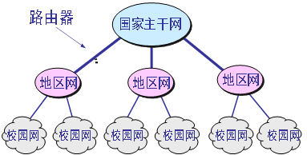

# 09-01数据通信的概念，计算机网络的组成与分类；了解信道复用技术和交换技术。
## 数据通信
* 通信目的：传递信息
* 通信主体：信源、信宿
* 通信载体：信道

### 信道、信号、调制
* **模拟信道** 所传输的信号叫**模拟信号** 其中代表信息的参数的取值方式为**连续取值**  
* **数字信道** 所传输的信号叫**数字信号** 其中代表信息的参数的取值方式为**离散取值**
* **调制**：数字信号在模拟信道上传输，数字信号要先转换成模拟信号，即需要调制。

### 计算机网络的性能指标
* **速率**：连接在计算机网络上的主机在**数字信道**上传送数据的速率，
    >也称为数据率或比特率，速率的单位是b/s（比特每秒），也可以写成bps(bit per second)。
进率1Tb/s=10^3^ Gb/s=10^6^ Mb/s=10^9^ Kb/s=10^12^ b/s
* **带宽**：信号具有的频带宽度，单位是赫（或千赫、兆赫、吉赫等）。
    >现在“带宽”是数字信道所能传送的“最高数据率”，单位是“比特每秒”，或 b/s (bit/s)。例如，100M以太网其带宽就是指最高数据率100Mb/s。
* **吞吐量**：单位时间内通过某个网络（或信道、接口）的数据量，经常用于测量现实世界中网络的数据量。吞吐量受网络的带宽和网络的数据率的限制。
* **时延**：数据从网络的一端传送到另一端所需要的时间。（时延指被延迟的时间，就是不得不花费的时间）
    >数据在网络中的总时延：
    >总时延=发送时延+传播时延+处理时延+排队时延

* **利用率**：分信道的利用率和网络的利用率

### 计算机网络的传输介质
* **导向型**（即有线）信号是沿着固体媒体（铜线、光纤）传播
    + 双绞线 UTP、STP
    + 同轴电缆
    + 光纤
* **非导向型**（即无线）。信号是在自由空间中传播
    + 无线
    + 微波
        - 微波通信的两种方式
            + 地面微波接力通信
            + 卫星通信
            - 移动通信

## 计算机网络组成与分类
### 计算机网络的发展
大致经历了四个主要发展阶段
1. **以主机为中心的联机终端网络系统**

主机既要承担通信工作，又要承担数据处理

1. **以通信子网为中心的主机互连**

网络内层是通信子网，负责网上各主机的通信处理，网络外层是由通信子网连接的主机所构成的资源子网，负责数据处理。

1. **具有层次化体系结构的标准化网络**
“开放系统互联参考模型”（Open System Interconnection/Recommended Model，OSI/RM）的制定标志着按照**网络体系结构标准建成的网络**称为第三代网络的诞生。

1. **因特网时代**

### 计算机网络的组成
* 计算机网络由
    + **计算机**、
    + **数据通信链路**和
    + **通信协议**组成。
* 计算机网络实现的**主要功能**：
    - 数据通信
    - 资源共享
    - 高可靠性
    - 节省投资
    - 分布式处理
3.计算机网络的分类
* 按**传输介质**可分为
    + 有线网和
    + 无线网；
* 按网络的**使用性质**可分为
    + 公用网和
    + 专用网；
* 按网络的**拓扑结构**可分为
    + 总线形、
    + 星形、
    + 树形、
    + 环形和
    + 网状结构，
    + 等等。
* 更常见的分类方法是按网络**覆盖的地理范围**进行分类，
计算机网络可以分为：
    + 局域网、
    + 城域网
    + 广域网

### 计算机网络的工作模式
**客户/服务器方式**：客户是服务请求方，服务器是服务提供方。
**对等方式**：通信中的两个主机并不区分哪一个是服务请求方，哪一个是服务提供方.

## 信道复用技术
1. 时分复用 时间
    + 同步时分复用（同步TDM）
    + 统计（异步）时分复用（统计TDM）
2. 频分复用 频率
3. 波分复用 波长
4. 码分复用 

## 交换技术
每一个数据报在传输过程中都必须带有源地址和目的地址；
同一报文的不同分组可以由不同的传输路径通过通信子网；
同一报文的不同分组到达目的端时可能出现乱序、重复或丢失现象；
目的端判断分组的正确性，并重新排列成原来的报文形式。

