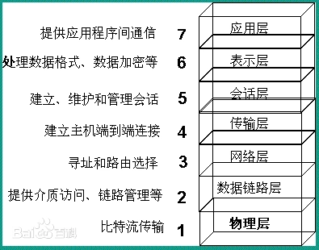
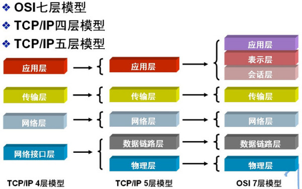

# 10-01掌握OSI和TCP/IP体系结构
 
#### OSI
| 第几层 | 名称 | 英文名称 | 解决问题 | 具体解决问题 | 
| :---: | ---: | :-----------------: | :--- | :--- | :--- |
| 第7层 | 应用层 | Application Layer | 应用程序之间的通信 | 提供为应用软件而设的接口，以设置与另一应用软件之间的通信 |
| 第6层 | 表达层 | Presentation Layer | 不同操作系统处理器架构对信息的表示 | 把数据转换为能与接收者的系统格式兼容并适合传输的格式；|
| 第5层 | 会话层 | Session Layer | 建立通信连接 | 负责在数据传输中设置和维护计算机网络中两台计算机之间的通信连接。 |
| 第4层 | 传输层 | Transport Layer | 不同进程之间基于网络的通信 | 解决不同进程间基于网络通信的问题；传输错误如何处理（误码、丢包）|
| 第3层 | 网络层 | Network Layer | 分组在多个网络中传输 | 如何标识各网络和其中的主机(IP地址)；路由器如何转发分组、如何进行路由选择 | 
| 第2层 | 数据链路层 | Data Link Layer | 分组在单个网络(或链路)中传输 | 标识（编址）网络中各主机;区分比特流中的地址段和数据段；协调各主机对总线的征用或实现以太网的分组交换； | 
| 第1层 | 物理层 | Physical Layer | 使用何种信号传输比特 | 采用什么传输介质；采用什么物理接口；采用什么信号表示0、1； | 物理层将帧看作比特流，处于以太网将为比特流添加前导码  |

#### TCP/IP
| 第几层 | 名称 | 英文名称 | 解决问题 | 具体解决问题 | 数据单元名称|              
| :---: | ---: | :-----------------: | :--- | :--- | :--- |
| 第5层 | 应用层 | Application Layer | 应用程序之间的通信 | 提供为应用软件而设的接口，以设置与另一应用软件之间的通信 | HTTP报文 | |  
| 第4层 | 运输层 | Transport Layer | 不同进程之间基于网络的通信 | 解决不同进程间基于网络通信的问题；传输错误如何处理（误码、丢包）| 添加TCP首部后称为TCP报文段 |
| 第3层 | 网际层 | Network Layer | 分组在多个网络中传输 | 如何标识各网络和其中的主机(IP地址)；路由器如何转发分组、如何进行路由选择 | 添加IP首部后称为IP数据报 |
| 第2层 | 数据链路层 | Data Link Layer | 分组在单个网络(或链路)中传输 | 标识（编址）网络中各主机;区分比特流中的地址段和数据段；协调各主机对总线的征用或实现以太网的分组交换； | 添加首部和尾部称为帧 |
| 第1层 | 物理层 | Physical Layer | 使用何种信号传输比特 | 采用什么传输介质；采用什么物理接口；采用什么信号表示0、1； | 物理层将帧看作比特流，处于以太网将为比特流添加前导码 |

## OSI/RM （Open System Interconnection/Reference Model,开放系统互连参考模型）
### 层次划分

### 第7层 应用层(Application Layer)
* 提供为应用软件而设的接口，以设置与另一应用软件之间的通信。例如: HTTP，HTTPS，FTP，TELNET，SSH，SMTP，POP3等。
### 第6层 表达层(Presentation Layer)
* 把数据转换为能与接收者的系统格式兼容并适合传输的格式。
### 第5层 会话层(Session Layer)
* 负责在数据传输中设置和维护计算机网络中两台计算机之间的通信连接。
### 第4层 传输层(Transport Layer)
* 把传输表头（TH）加至数据以形成数据包。传输表头包含了所使用的协议等发送信息。例如:传输控制协议（TCP）等。
### 第3层 网络层(Network Layer)
* 决定数据的路径选择和转寄，将网络表头（NH）加至数据包，以形成分组。网络表头包含了网络数据。例如:互联网协议（IP）等。
### 第2层 数据链路层(Data Link Layer）
* 负责网络寻址、错误侦测和改错。当表头和表尾被加至数据包时，会形成帧。数据链表头（DLH）是包含了物理地址和错误侦测及改错的方法。数据链表尾（DLT）是一串指示数据包末端的字符串。例如以太网、无线局域网（Wi-Fi）和通用分组无线服务（GPRS）等。
    >* 分为两个子层：
    >    + 2.2 逻辑链路控制（logic link control，LLC）子层 
    >        - 该子层通过在IP包上加了8位的目的地址服务接入点和源地址服务接入点来保证在不同网络类型中传输
    >        - 另外，有一个8或16位的控制字段用于像流控制的辅助功能。
    >        - LLC头部格式：
    >          - DSAP（Destination Service Access Point，目标服务接入点）字节，8位比特
    >          - SSAP（Source Service Access Point，源服务接入点）字节，8位比特
    >          - Control（控制）字段，8或16位比特
    >        - 三种LLC PDU控制字段，分别叫做U，I，S帧。
    >          - U（Unnumbered） 帧，8位的控制字段，特别用于无连接的应用
    >          - I（Information）帧，16位的控制和帧编号字段，用于面向连接的应用
    >          - S（Supervisory）帧，16位的控制字段，用于在LLC层中进行管理监督。
    >          - 在这三种格式中，只有U帧在广泛使用。用第一个字节的最后两位来区分这三种PDU帧格式。
    >    + 2.1 介质访问控制（media access control，MAC）子层。
    >        - 把 上层 逻辑链路控制子层
    >        - 把 底层 物理层01比特流组**建成帧**，并通过帧尾部的错误校验信息进行**错误校验**
    >        - MAC子层**分配单独的局域网地址**，就是通常所说的MAC地址（物理地址）。
    >            - MAC子层将目标计算机的物理地址添加到数据帧上，当此数据帧传递到对端的MAC子层后，对端计算机的mac子层检查该目标地址是否与自己的地址相匹配，如果帧中的地址与自己的地址不匹配，就将这一帧抛弃；如果相匹配，就将它发送到上一层中
    >        - 提供对共享介质的访问方法
    >            - 以太网的**带冲突检测的载波侦听多路访问**（CSMA/CD）
    >            - 令牌环（Token Ring）
    >            - 光纤分布式数据接口（FDDI）等
### 第1层 物理层(Physical Layer)
* 在局部局域网上传送数据帧（data frame），它负责管理计算机通信设备和网络媒体之间的互通。包括了针脚、电压、线缆规范、集线器、中继器、网卡、主机适配器等。

## TCP/IP（Transmission Control Protocol/Internet Protocol，传输控制协议/网际协议）
* TCP/IP协议的组成（百度）
  1. 应用层、表示层、会话层三个层次提供的服务相差不是很大，所以在TCP/IP协议中，它们被合并为应用层一个层次。 
  2. 由于运输层和网络层在网络协议中的地位十分重要，所以在TCP/IP协议中它们被作为独立的两个层次。 
  3. 因为数据链路层和物理层的内容相差不多，所以在TCP/IP协议中它们被归并在网络接口层一个层次里。
* TCP/IP协议中的四个层次（百度）
  * 应用层：应用层是TCP/IP协议的第一层，是直接为应用进程提供服务的。
    1. 对不同种类的应用程序它们会根据自己的需要来使用应用层的不同协议，邮件传输应用使用了SMTP协议、万维网应用使用了HTTP协议、远程登录服务应用使用了有TELNET协议。 
    2. 应用层还能加密、解密、格式化数据。 
    3. 应用层可以建立或解除与其他节点的联系，这样可以充分节省网络资源。 
  * 运输层：作为TCP/IP协议的第二层，运输层在整个TCP/IP协议中起到了中流砥柱的作用。且在运输层中，TCP和UDP也同样起到了中流砥柱的作用。 
  * 网络层：网络层在TCP/IP协议中的位于第三层。在TCP/IP协议中网络层可以进行网络连接的建立和终止以及IP地址的寻找等功能。 
  * 网络接口层：在TCP/IP协议中，网络接口层位于第四层。由于网络接口层兼并了物理层和数据链路层所以，网络接口层既是传输数据的物理媒介，也可以为网络层提供一条准确无误的线路。 

