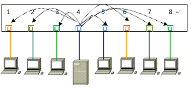
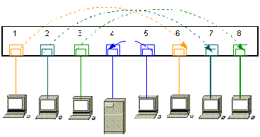
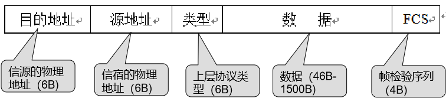
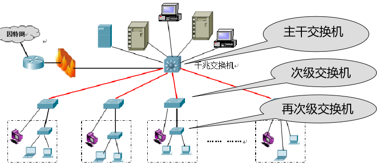

# 10-02局域网的特点、组成
## 局域网
1. 局域网的三个关键技术
    * 拓扑结构
       + 总线形
       + 星形
       + 环形
    * 传输介质
      + **基带传输**常用的传输介质有双绞线、同轴电缆和光纤；
      + **宽带传输**常用的传输介质有同轴电缆和无线电波等。
    * 介质访问控制方法
        * 介质访问控制方法是指网络上的多个站点共享信道的方式，这些方式与网络采用的拓扑结构和传输介质相关。
        > 例如：
        **星形网络**:可以采用**CSMA/CD控制方式**，
        **环形网络**:可以采用**Token Passing控制方式**。
        **无线电波传输介质的网络**:则常使用**CSMA/CA控制方式**。
2. 局域网的组成
    * 局域网大体由**计算机**、**传输介质**、**网卡**、**网络互连设备**组成。
    * 网卡
        + **插在计算机总线插槽内或某个外部接口上的扩展卡**，与**网络程序**配合工作，
        + 负责将要发送的数据转换为网络上其他设备能够识别的格式----**封装成帧**，**通过传输介质进行传输**，
        + 或将接收到的信息转换成网络程序能够识别的格式----**帧解封装**，交给**网络操作系统**。
    * 网络互连设备
        + 集线器
        >集线器是**工作在物理层**的网络设备，是在物理层上对网络的扩展
        **把从一个端口接收到的数据帧以广播方式向其他所有端口分发出去**，并对信号进行放大，以扩大网络的传输距离，**起到中继器的作用**。
        + 交换机
        >交换机是**工作在数据链路层**的网络设备，是在数据链路层上对网络的扩展
        **交换机能同时连通许多对的端口**，使每一对相互通信的主机都能像独占通信媒体那样，进行无碰撞地传输数据。
    * 数据传输
       + 通信双方将数据在数据链路层封装成MAC帧，然后交给物理层进行位传输和接收
       
3. 以太网
    * 传统以太网 运行在**10Mbps**速率的以太网。采用的是**载波侦听多点接入/冲突检测**（Carrier Sense Multiple Access with Collision Detection，CSMA/CD）协议。
    * 高速以太网 速率**达到或超过100Mbps**的以太网（仍然称其以太网是因为高速以太网的数据结构与传统以太网类似或相同）
    * 以太网构成

