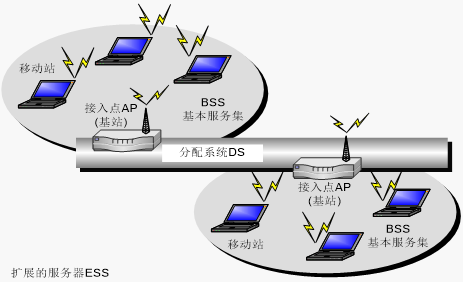

# 10-03无线网的特点、组成
1. 无线网络主要设备
    * 无线网卡：主要分为三种类型，即PCMCIA无线网卡、PCI无线网卡和USB无线网卡。
    * 无线接入点（Access Point，AP）：将无线站点连接成为网络，相当于集线器和交换机，是移动计算机用户进入有线以太网骨干的接入点。
    * 无线天线：发送和接收电磁波。无线天线分为室内和室外两种。
2. 无线网络分类
    * 无线个人网（WPAN）：在个人活动范围内所使用的无线网络。主要采用蓝牙技术和ZigBee技术。
    * 无线局域网（WLAN）：以无线方式实现传统以太网的所有功能。
    >采用IEEE 802.11系列标准协议。具有有线局域网和无线基站等基础设施的无线局域网由基本服务集合（Basic Service Set， BSS）和扩展服务集（Extended Service Set，ESS）组成。
    

    * 无线城域网：范围可覆盖50km，并采用点对点、点对多点的固定接入。
    * 无线广域网：传输范围可跨越国家或不同城市的无线网络，由于其网络覆盖范围大，需要运营商来架设及维护整个网络。采用IEEE802.20标准，工作频段为3.5GHz以下。

