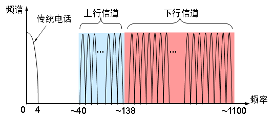
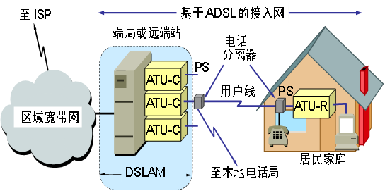
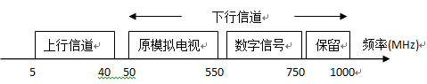
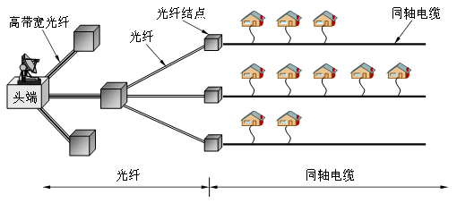

# 11-02常见宽带接入技术
## 宽带接入技术
1. ADSL接入技术
  * 非对称数字用户线 (Asymmetric Digital Subscriber Line ，ADSL)技术就是用数字技术对现有的模拟电话用户线进行改造，使它能够承载宽带业务。
  * 用户计算机中的网卡与ATU-R连接。
  * 电话分离器PS同时也将电话连接到本地电话交换机，它可以将电话信号和数字信号隔开，这样电话通话和数据通信相互不干扰，使用主机拨号软件进行拨号连接就可以实现上网工作。
    
    

2. 光纤同轴混合网
    * 利用Cable MODEM，其原理与ADSL相似，但Cable MODEM不是成对使用，而是只安装在用户端，它将同轴电缆的频带划分为三个部分，分别用于数据上传、数据下传以及电视节目的下传。
    * HFC网的主干线路采用光纤连接到小区，然后在 “最后1公里”时使用同轴电缆以树枝型总线方式接入用户居所
      
      

3. 光纤接入技术
    * **光纤接入**是指**局端**与**用户**之间**完全**以**光纤**作为**传输媒体**。
    * 光纤接入可以分为
        + **有源光接入**和
        + **无源光接入**。
    * 根据光纤深入用户群的程度，可将光纤接入网分为
        + **FTTC**（光纤到路边）、
        + **FTTZ**（光纤到小区）、
        + **FTTB**（光纤到大楼）、
        + **FTTO**（光纤到办公室）和
        + **FTTH**（光纤到户），它们
        + **统称**为**FTTx**。

4. 无线接入技术
    * 通过无线介质将用户终端与网络节点连接起来，以实现用户与网络间的信息传递。

