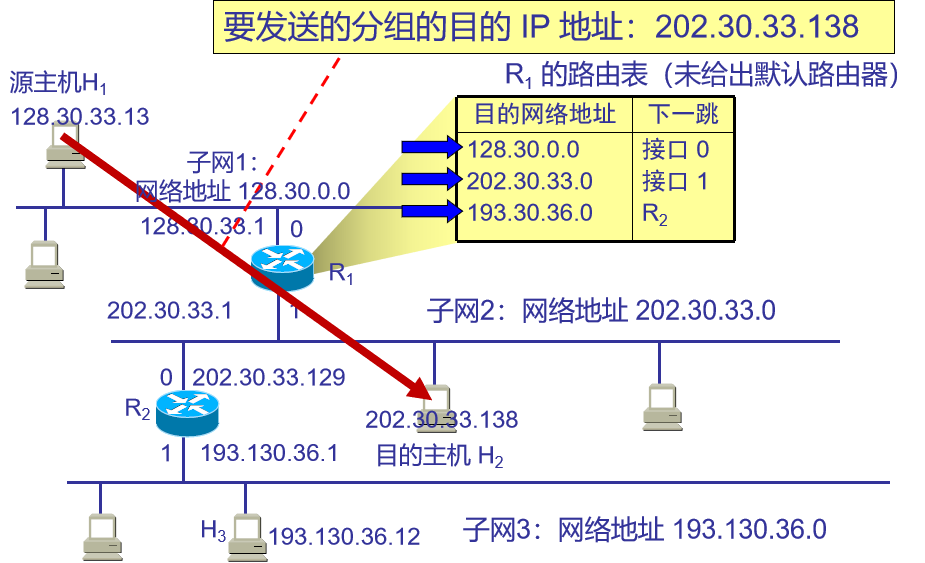

# 11-03IP数据报原理
## IP地址
IP地址是IP协议提供的一种统一的地址格式，是给每个连接在因特网上的主机（或路由器）分配一个在全世界范围内惟一的标识符，以此来屏蔽物理地址的差异。

## IP地址分类

>例4.2 判断IP地址202.158.133.3是属于哪一类地址，网络地址是什么？
    根据IP地址的第一个字节202的二进制为1100 1010，属于C类网络，网络号由前3个字节表示，即网络地址是：202.158.133.0。
## 子网的划分
从主机号借用若干个位作为子网号，而主机号也就相应减少了若干个位，利用子网掩码来确定网络号和主机号。
>例如，B类网络地址：135.122.0.0，从主机号中借4位作为子网号，则子网掩码是255.255.240.0，
要确定一个主机地址（135.122.69.3）的子网地址，只需要用IP地址与子网掩码进行与运算就可以得到子网网络地址：135.122.64.0。

## IP数据报

## 3.路由转发
* 路由器转发是依据路由器中的路由表。
* 路由表通常会包括三项内容：
    + 目的网络地址、
    + 子网掩码和
    + 下一跳地址。
* 路由器转发数据报就是要提取IP数据报中的目的地址和路由表中的目的网络地址进行比较，选择向该网络地址的网络的出口方向从输出端口转发出去。
>列如：
>H1 要发送分组给 H2 
>H1 首先检查主机 202.30.33.138 是否连接在本网络上
>如果是，则直接交付；
>否则，就送交路由器 R1，并逐项查找路由表。
>路由器 R1 收到分组后就用分组中的目的网络和路由表中的目的地址进行逐个比较，匹配后交给该下一条所指定接口，不匹配则交给默认路由所指定接口
>
